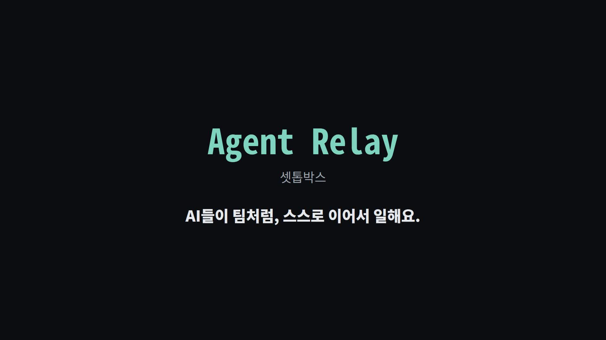

# Agent Relay

> AI 여러 개가 **계획(PM) → 만들기(Worker) → 검사(QA)** 를 스스로 이어 가는 셋톱박스.
> 사람은 결과를 보고, 꼭 필요한 결정에만 답하면 됩니다.

## 30초 소개 영상

[](docs/media/agentrelay-30s.mp4)

전체 소개 (60초): https://youtu.be/tB1cCLzTvIs

코딩을 모르지만 Claude·Codex 같은 AI 도우미를 여러 개 쓰는 분을 위한 프로그램입니다.
"지금 뭐가 돌아가고, 내가 할 일이 있나?"를 한 화면에서 알려 주는 Windows 데스크톱 앱(Electron)이
있고, 그 뒤에서 작업을 이어 주는 실행기(CLI)가 있습니다. DB도 클라우드도 없이 파일과 Git으로만 동작합니다.

## 지금 되는 것

- **관제실** — 프로젝트별로 지금 누가 무슨 작업을 하는지, 내가 할 일이 있는지 한 문장으로 보여 줘요.
- **멈춘 작업을 쉬운 말로** — 멈춘 이유를 한 문장으로 풀어 주고, 선택지 3개(다시 시도 · 다음 작업으로 진행 · 내가 직접 볼게요)를
  카드로 보여 줘요. 추천이 맨 앞에 있고, 대기 시간이 정해진 경우
  "아무것도 안 고르면 14:40에 추천대로 진행해요"처럼 시각을 알려 줘요. 원문은 `원문 보기` 뒤에 접혀 있어요.
- **승인 규칙** — 묻지 말고 진행해도 된다고 허락한 규칙을 종류별로 모아 보여 주고,
  얼마나 자주 쓰였는지도 알려 줘요.
- **계획 화면** — 프로젝트의 목표와 작업 순서, PM과의 대화, 승인을 한곳에서 봐요.
- **검사는 다른 AI가** — 실행기는 만든 AI와 같은 AI가 검사하도록 두지 않아요(같으면 멈추고 알려 줘요).
  QA는 코드를 고치지 못하는 읽기 전용으로 돌아가요.
- **밤 자동 작업 (Night Run)** — 정해 둔 마감 시각(운영 기준 05:00)까지 작업을 이어 가다 멈추고,
  결과 보고서를 남겨요. 끝나지 않은 작업은 다음 실행에서 이어서 해요.
- **기록 정리** — AI에게 준 프롬프트와 결과를 날짜·AI·회차별 Markdown 파일로 저장해요.

## 빠른 시작

Windows 앱으로 쓰기:

1. [Releases](https://github.com/ju0o/Agent-Relay/releases)에서 `AgentRelay-Setup-x.y.z.exe`를 받아 실행해요.
   (코드 서명이 없어 처음에 Windows 경고가 뜰 수 있어요 — "추가 정보 → 실행")
2. 처음 열면 기록을 저장할 폴더를 한 번만 고르세요. `[기본 폴더 사용]` 한 번이면 끝이에요.
3. 위쪽 **관제실 → 승인 규칙 → 계획** 순서로 둘러보세요.

소스에서 직접 실행하기 (Node.js 필요):

```bash
npm install
npm run dev                         # 빌드 후 데스크톱 앱 실행
node bridge/agent-relay.mjs core-v1 status         # 프로젝트별 진행 상황 보기
node bridge/agent-relay.mjs core-v1 start          # 작업 이어 가기 시작
node bridge/agent-relay.mjs night-run up --deadline 05:00   # 밤 자동 작업
npm test                            # 테스트
```

CLI 전체 목록, E2E, 릴리스 방법은 [docs/DEVELOPER.md](docs/DEVELOPER.md),
밤 작업 준비(전원 끄기 권한 등)는 [docs/CORE_V1_AUTO_NIGHT_RUN.md](docs/CORE_V1_AUTO_NIGHT_RUN.md)를 보세요.

## 다른 프로그램과의 관계

```text
actl (리모컨)
   └─▶ Agent Relay (셋톱박스: PM → Worker → QA)
          └─▶ JuControler (허브: JuPlan · JuCeipt · Tester)
```

- 이 저장소에 들어 있는 것은 **Agent Relay** 하나예요. 나머지는 각자 따로 있는 프로그램이에요.
- 실행기는 `config/portfolio.json`에 적힌 프로젝트(Agent Relay · actl · JuPlan · JuCeipt)를 순서대로 돌려요.

## 아직 안 되는 것

- **AI 자동 배정의 엔진은 이 저장소에 없어요.** 앱은 구독 AI를 먼저, 무료 모델(예비)은 보조로 쓰는
  배정 순서와 쉬는 AI를 보여 주고, 만드는 AI·검사하는 AI를 고르게 해 줘요. 실제 배정과
  추천대로 진행하는 일은 작업 PC의 밤 작업 도구가 맡아요. 그 PC에 연결(SSH)돼 있어야 관제실이 채워지고,
  꺼져 있거나 네트워크가 끊기면 "작업 PC(…)에 연결할 수 없습니다"라고 알려 줘요.
- **프로젝트·역할별 Skill과 승인한 기억 전달**은 이 저장소 코드에는 아직 없어요.
- 자동 진행까지 기다리는 시간은 작업마다 달라요. 고정 30분이 아니에요.
- macOS·Linux용 앱은 없어요(Windows 설치형과 Portable만). 코드 서명도 아직 없어요.
- 앱 아이콘은 기본 Electron 아이콘이에요.
- actl의 마지막 Windows 확인 등 일부 프로젝트는 사람이 직접 확인해야 끝나요.

더 자세한 내용: [기록 저장·피드백 상세](docs/RECORDS_AND_DOGFOODING.md) · [남은 개선 목록](BACKLOG.md)

## English summary

Agent Relay is a local "set-top box" that chains several AI assistants through Plan (PM) → Build (Worker) → Check (QA), for non-developers.
It ships a Windows desktop app (control room · approval rules · plan view) plus a Node CLI runner (`bridge/agent-relay.mjs`).
QA must be a different AI from the builder, stuck tasks become one plain sentence with three options, and Night Run works until a deadline.
Everything is files and Git — no database, no cloud, no telemetry; the only network call is the update check.
AI auto-assignment and skill/memory delivery are not in this repo yet; see "아직 안 되는 것".
